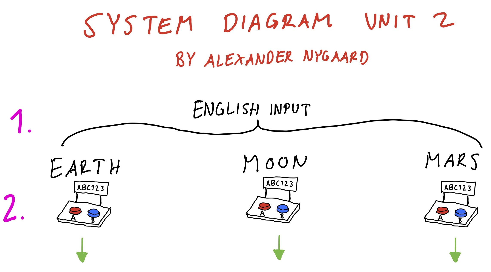
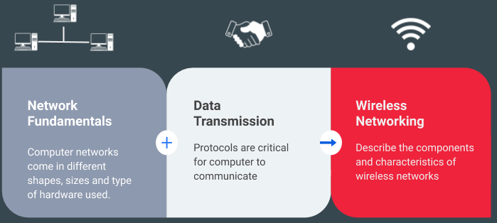
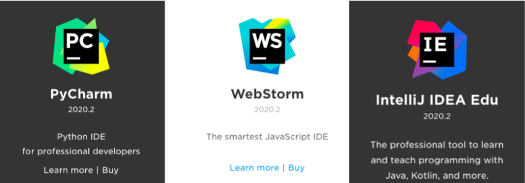

## UWC ISAK COMPUTER SCIENCE 2020
Welcome! 

Computer Science is as experimental science. From the early days with analog computers breaking war codes [(A.M. Turing)](https://fermatslibrary.com/s/intelligent-machinery-a-heretical-theory) to the modern times with virtual/augmented reality [(Hidden Creative 2010)](https://www.youtube.com/watch?v=tnRJaHZH9lo), cryptocurrencies [(VICE 2019)](https://www.youtube.com/watch?v=u-vrdPtZVXc&t=252s), machine learning [(Science Time 2020)](https://www.youtube.com/watch?v=NjVIQUE8Sgk) or artificial intelligence [(WSJ 2019)](https://www.youtube.com/watch?v=JMLsHI8aV0g) [(DW 2020)](https://www.youtube.com/watch?v=-ePZ7OdY-Dw), Computer Science has been at the forefront of innovation transforming our lives. At UWC ISAK Japan, the study of Computer Science is pursued using a variety of projects exploring connections with other fields including Art, Neuroscience, Economics, Data Science, and Biology. These projects provide an authentic environment where all the participants can master the syllabus, develop their Computational Thinking Skills while discovering modern technologies.  

In a concise way:

"Computer science requires an understanding of the fundamental concepts of computational thinking as well as knowledge of how computers and other digital devices operate." [IB Computer Science Guide 2017](CompSciGuide.pdf)

"Computational thinking represents a universally applicable attitude and skill set everyone, not just computer scientists, would be eager to learn and use."  [(Wing, Jeanette M. 2006)](https://www.cs.cmu.edu/~15110-s13/Wing06-ct.pdf)

See some examples from last's year G11 project work here:

1. Unit 3: Creating a Graphical User Interface for a real client with Python. [Github repository by Lydia Etherington](https://github.com/lyds-jane/unit3)

1. Unit 2: An inter planetary communication system with Modern C and Arduino. [Github repository by Alex Nygaard](https://github.com/Alex-Nygaard/martianUnit2Project)  

1. Uni 1: A car rental application in basic BASH programming. [Github repository by Lauricenia Buque](https://github.com/comsci-uwc-isak/unit-1-project-Lauricenia)

## 1. How to succeed in this course

To succeed in this course you should:

1. Routinely read the material before class. This will allow you to ask questions and participate.
1. Practice your Computational Thinking Skills by solving the programming challenges. Go beyond the exercises assigned and develop mastery.
1. Complete the assignments and deadlines.

## 2. The Syllabus

SL/HL core
The topics that must be studied, including some practical work, are:

* Topic 1: System fundamentals (20 hours)

* Topic 2: Computer organization (6 hours)

* Topic 3: Networks (9 hours)

* Topic 4: Computational thinking, problem-solving and programming (45 hours)

HL extension
The topics that must be studied, including some practical work, are:
* Topic 5: Abstract data structures (23 hours)
* Topic 6: Resource management (8 hours)
* Topic 7: Control (14 hours)

[See more](syllabus.md).

## 3. The Assessment

**Table 1.** Description of the assessment components for SL and HL

| Assessment Component                    | Weighting SL | Weighting HL |
|-----------------------------------------|--------------|--------------|
| Paper 1: (1 h 30 min)                   | 45%          | 40%          |
| Paper 2: Option (1 h)                   | 25%          | 20%          |
| Paper 3: Case Study (1 h)               | -            | 20%          |
| Internal Assessment (IA): (30 h)        | 30%          | 20%          |

Paper 1 includes a combination of short answer questions testing mainly knowledge, understanding, and application of concepts or tools from Topic 1 to 4 (SL) and Topic 1 to 7 for (HL). It also includes structured questions that required extended writing or solutions.

Paper 2 is the option from the syllabus among:
* Option A: Databases
* Option B: Modelling and simulation
* Option C: Web science
* Option D: Object-oriented programming (OOP)

## 4. Tools we will use

We will use the Integrated Development Editors (IDE) from JetBrains. These are professional grade software tools free for UWC Students. From all the different favours JetBrain I recommend:

1. [Pycharm](https://www.jetbrains.com/pycharm-edu/): Editor for Python
1. [WebStorm](https://www.jetbrains.com/webstorm/): Editor for Web Development
1. [Intelli J IDEA](https://www.jetbrains.com/idea-edu/): Editor for Java 

Create a free account at [JetBrains.com](https://www.jetbrains.com/), with your UWC ISAK email account. Then download the tools and install them in your computer. If you are using a school's laptop, you will have to find Rie-san in the IT office to get the password.

## 5. Resources

